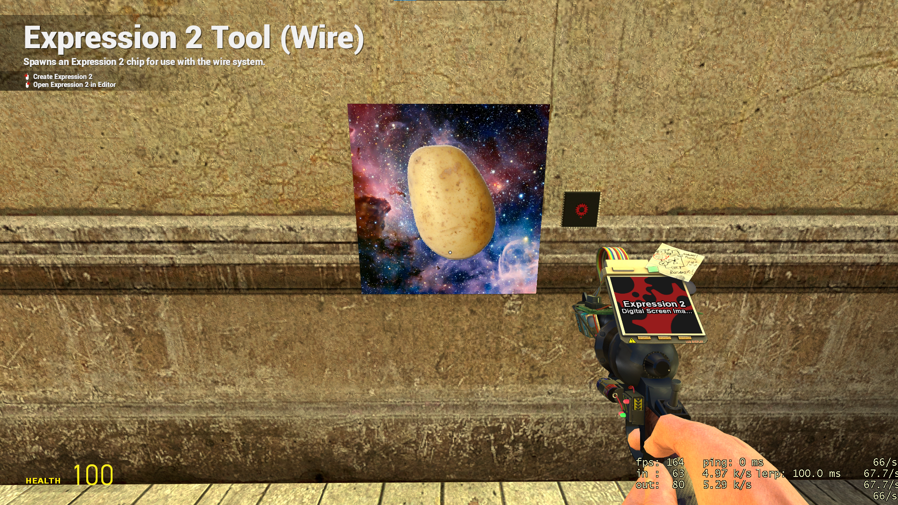

# Garry's Mod Expression 2 Image Viewer

# How to use

1. Download from releases.
2. Make a new E2 files.
    1. Copy `digital_screen_image_display.e2` into e2 folder.
    2. Create new e2 file called `imagedata.e2`.
3. Drag any image onto the executable.
4. Copy the `output.txt` contents into `imagedata.e2`.
5. Place `digital_screen_image_display.e2` in the world.
6. Place a `Digital Screen` in the world.
    1. Wire `Expression 2` to the `Digital Screen`.
7. Watch as the image is slowly displayed on the screen.
